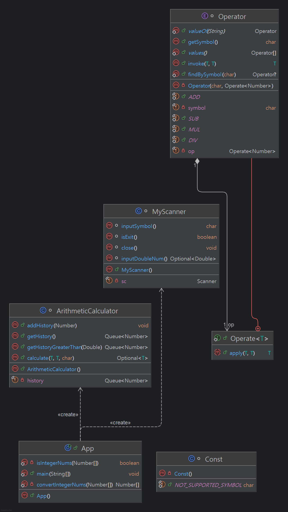

# CH 2: 계산기 과제

## 단계별 목표
- **클래스를 사용하지 않는 계산기:**
  - [level 1] : `필수 구현` 클래스 없이 자바의 기본 문법만을 사용하여 구현한 계산기


- **클래스를 활용한 계산기:**
  - [level 2] : `필수 구현` 객체 지향 개념을 적용하여 클래스 정의, 연산을 수행하는 메소드 작성한 계산기
  - [level 3] : `도전 구현` 자바의 Enum, 제네릭, 람다 & 스트림을 적용한 계산기


## 파일 구조
```bash
src
├──── level1
│  └──── App.java
├──── level2
│  ├──── App.java
│  ├──── Const.java
│  ├──── Calculator.java
│  └──── MyScanner.java
├──── level3
│  ├──── App.java
│  ├──── ArithmeticCalculator.java
│  ├──── Const.java
│  ├──── MyScanner.java
│  └──── Operator.java
└──── README.md
```
## 과제 진행 요약
### 🌱 Level 1
- 요구사항 정의 및 설계: [Lv1. 요구사항 정의 및 설계](https://gajicoding.tistory.com/173)
- 문제 해결 (트러블 슈팅)
  - [반복문 안에서 InputMismatchException 예외 발생 시 무한 루프 발생](https://gajicoding.tistory.com/174)
- 새로운 지식
  - [switch 표현식 (Switch Expression)](https://gajicoding.tistory.com/175)


- UML <br/><br/>

---


### 🌿 Level 2
- 요구사항 정의 및 설계: [Lv2. 요구사항 정의 및 설계](https://gajicoding.tistory.com/179)
- 코드 개선 (리팩토링)
  - [유효성 검사는 어디에서 해야 될까?](https://gajicoding.tistory.com/178)
  - [Optional 제대로 사용하기](https://gajicoding.tistory.com/180)
- 새로운 지식
  - [커밋 컨벤션 (Commit Convention)](https://gajicoding.tistory.com/176)
  - [유틸리티 클래스 (Utility Class)](https://gajicoding.tistory.com/177)


- UML <br/><br/>

---


### 🌳 Level 3
- 요구사항 정의 및 설계: [Lv3. 요구사항 정의 및 설계](https://gajicoding.tistory.com/190)
- 코드 개선 (리팩토링)
  - [getItems.add(...) vs addItem(...)](https://gajicoding.tistory.com/189)
- 문제 해결 (트러블 슈팅)
  - [java: incompatible types: T cannot be converted to capture#1 of ?](https://gajicoding.tistory.com/188)
- 새로운 지식
  - [Enum 열거형 타입](https://gajicoding.tistory.com/181)
  - [어노테이션(Annotation)](https://gajicoding.tistory.com/187)

- UML <br/><br/>
  
